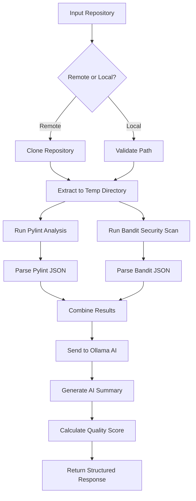
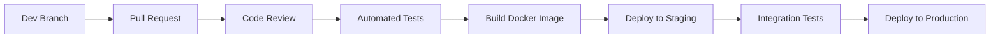

# CodeMentorAI

🚀 **Platformă AI inteligentă pentru analiza și evaluarea calității codului sursă**

CodeMentorAI este o soluție modernă full-stack care combină analiza statică avansată cu inteligența artificială pentru a oferi feedback detaliat și acționabil despre proiectele de cod. Platforma suportă multiple metode de input și generează rapoarte comprehensive cu scoruri de calitate, rezumate AI și identificarea problemelor critice.

---

## 🌟 Funcționalități Principale

### 📊 **Analiză Multi-Modală**
- **Repository-uri Git** - Clonează și analizează proiecte direct din link-uri GitHub/GitLab/Bitbucket
- **Arhive ZIP** - Încarcă și analizează proiecte complete din arhive ZIP
- **Fișiere Individuale** - Evaluează fișiere unice de cod, documente, imagini sau orice alt tip de fișier
- **Analiză Cross-Platform** - Suport pentru Windows, Linux, macOS

### 🤖 **Inteligență Artificială Avansată**
- **Integrare Ollama** - Platformă locală pentru rularea modelelor AI
- **Model qwen2.5:1.5b** - Model AI optimizat pentru analiză de cod
- **Rezumate Inteligente** - Generare automată a sumarelor calitative
- **Sugestii de Îmbunătățire** - Recomandări specifice pentru fiecare problemă identificată

### 📈 **Raportare Detaliată**
- **Scor de Calitate** - Evaluare numerică (0-100) bazată pe problemele identificate
- **Clasificare Probleme** - Categorizare după severitate (critical, high, medium, low)
- **Tipologii** - Calitate, Securitate, Performanță, Stil
- **Interfață Interactivă** - Filtrare, căutare, expandare detalii

### 🎨 **Experiență Utilizator Modernă**
- **Design Dark Mode** - Temă elegantă cu gradient-uri și efecte glassmorphism
- **Responsive Design** - Adaptabil pentru toate dimensiunile de ecran
- **Real-time Feedback** - Actualizări instantanee în timpul analizei
- **Drag & Drop** - Interfață intuitivă pentru încărcare fișiere

---

## 🏗️ Arhitectura Sistemului

### 📋 **Arhitectura Generală**
```
┌─────────────────┐    ┌─────────────────┐    ┌─────────────────┐
│   Frontend      │    │    Backend      │    │   AI Services   │
│   (Next.js)     │◄──►│   (FastAPI)     │◄──►│   (Ollama)      │
│                 │    │                 │    │                 │
│ • UI/UX         │    │ • API Endpoints │    │ • qwen2.5:1.5b  │
│ • State Mgmt    │    │ • Static Analysis│   │ • Text Gen      │
│ • File Upload   │    │ • File Processing│   │ • JSON Parsing  │
└─────────────────┘    └─────────────────┘    └─────────────────┘
```

### 🔧 **Backend (Python/FastAPI)**

#### **Structura Fișierelor**
```
backend/
├── main.py                    # Server FastAPI principal & API endpoints
├── services/
│   ├── analyze.py            # Logica de analiză a repository-urilor
│   ├── analyze_file.py       # Analiza fișierelor individuale
│   └── ollama_client.py      # Client pentru comunicarea cu Ollama AI
├── __pycache__/              # Cache Python compilat
```

#### **Componente Principale**

**1. API Server (`main.py`)**
- **FastAPI Application** - Server web modern cu auto-documentare
- **CORS Middleware** - Configurare cross-origin pentru frontend
- **4 API Endpoints**:
  - `GET /api/analyze` - Analiză repository via query parameter
  - `POST /api/analyze` - Analiză repository via JSON body
  - `POST /api/upload` - Upload și analiză arhivă ZIP
  - `POST /api/analyze-file` - Analiză fișier individual
- **Error Handling** - Gestionare robustă a erorilor HTTP
- **File Validation** - Validare tipuri și dimensiuni fișiere

**2. Repository Analysis (`services/analyze.py`)**
- **Remote Detection** - Identificare repository-uri remote (HTTP, HTTPS, SSH, Git)
- **Git Cloning** - Clone automată cu depth=1 pentru eficiență
- **Static Analysis Tools**:
  - **Pylint** - Analiză calitativă cod Python (output JSON)
  - **Bandit** - Analiză securitate cod Python (output JSON)
- **Result Processing** - Combinare și prioritizare probleme
- **AI Integration** - Trimitere rezultate către Ollama pentru analiză avansată
- **Score Calculation** - Formula: `max(0, 100 - număr_probleme)`

**3. File Analysis (`services/analyze_file.py`)**
- **Multi-format Support** - 200+ extensii de fișiere recunoscute
- **Content Extraction**:
  - **Text Files** - Citire directă cu encoding UTF-8
  - **Images** - Detectare tip și metadate
  - **PDFs** - Identificare documente PDF
  - **Binary Files** - Analiză header și detectare tip
- **MIME Type Detection** - Identificare automată tip fișier
- **Content Truncation** - Optimizare pentru modele AI (1500 caractere max)
- **Prompt Engineering** - Generare prompt-uri personalizate per tip fișier

**4. AI Client (`services/ollama_client.py`)**
- **Ollama Integration** - Comunicare cu serverul Ollama local
- **Model Configuration** - qwen2.5:1.5b cu timeout 60 secunde
- **JSON Parsing** - Extracție și validare răspunsuri JSON
- **Error Handling** - Fallback responses pentru erori de conexiune
- **Two Modes**:
  - `ask_ai()` - Mode structurat pentru code review
  - `get_ai_analysis()` - Mode liber pentru analiză generală

### 🎨 **Frontend (Next.js/TypeScript)**

#### **Structura Fișierelor**
```
frontend/
├── app/
│   ├── page.tsx              # Pagina principală (Home)
│   ├── layout.tsx            # Layout global cu fonturi Geist
│   ├── analyze/
│   │   └── page.tsx          # Pagina de analiză (placeholder)
│   └── components/
│       ├── FileInput.tsx     # Componenta principală (700+ linii)
│       ├── LiquidNav.tsx     # Navigație principală
│       ├── ResultCard.tsx     # Card rezultate (placeholder)
│       └── Loader.tsx        # Componentă încărcare (placeholder)
├── public/                   # Resurse statice (iconițe SVG)
├── styles/                   # Fișiere CSS globali
├── .git/                     # Repository Git
├── package.json              # Dependințe npm
├── tsconfig.json             # Configurare TypeScript
├── next.config.ts            # Configurare Next.js
└── Dockerfile               # Configurare Docker frontend
```

#### **Componente Principale**

**1. FileInput Component (`components/FileInput.tsx`)**
- **State Management** - 10+ stări React cu useState și useMemo
- **Multi-tab Interface** - 3 moduri: repo, zip, file
- **File Upload** - Drag & drop cu validare tipuri fișiere
- **API Integration** - Fetch cu error handling și loading states
- **Results Display**:
  - Score Header cu metrici și statistici
  - AI Summary cu formatare markdown
  - Issues List cu filtrare și căutare
  - Expandable cards cu detalii complete
- **Interactive Features**:
  - Filter by category (all, quality, security, performance, style)
  - Search functionality across issues
  - Expand/collapse issue details
  - Severity indicators cu color coding
- **Modal System** - Dialog modal pentru selectare sursă

**2. LiquidNav Component (`components/LiquidNav.tsx`)**
- **Modern Navigation** - Design glassmorphism cu backdrop blur
- **Branding** - Logo Code2 și titlu "CodeMentor AI"
- **Responsive Layout** - Flexbox cu justify-between
- **Visual Effects** - Gradient backgrounds și shadow effects

**3. Layout System (`app/layout.tsx`)**
- **Font Configuration** - Geist Sans și Geist Mono
- **Metadata Management** - Title și description SEO
- **Global Structure** - HTML lang="en" cu body classes

---

## 🔧 Tehnologii și Stack Tehnic

### **Backend Stack**
- **Python 3.14** - Limbaj principal cu typing avansat
- **FastAPI 0.104+** - Framework web async cu auto-documentare OpenAPI
- **Uvicorn** - Server ASGI high-performance
- **Pylint** - Static analysis tool pentru Python
- **Bandit** - Security linter pentru Python
- **Requests** - HTTP client cu timeout și retry logic
- **Subprocess** - Execuție comenzi externe (git, pylint, bandit)
- **Tempfile** - Management fișiere temporare
- **Zipfile** - Manipulare arhive ZIP
- **JSON & Re** - Parsing și pattern matching

### **Frontend Stack**
- **Next.js 16** - React framework full-stack cu App Router
- **TypeScript 5** - Type safety și IntelliSense avansat
- **React 19** - UI library cu hooks moderne
- **Tailwind CSS 4** - Utility-first CSS framework
- **Lucide React** - Icon library modernă
- **ESLint** - Code quality și consistency

### **AI & Analytics Stack**
- **Ollama** - Local AI platform
- **qwen2.5:1.5b** - Lightweight AI model (1.5B parameters)
- **JSON Schema** - Structured output validation
- **Prompt Engineering** - Optimizare pentru small models

### **Development & Deployment**
- **Docker** - Containerizare pentru producție
- **Git** - Version control
- **Node.js 20** - JavaScript runtime
- **npm** - Package manager

---

## 📋 API Documentation

### **Base URL**
```
Development: http://localhost:8000
Production:  https://api.codementor.ai
```

### **Endpoints**

#### **1. Repository Analysis**
```http
GET /api/analyze?repo_path=<string>
```
**Parameters:**
- `repo_path` (query, required) - Path to repository or Git URL

**Response:**
```json
{
  "score": 85,
  "summary": "Codul este bine structurat cu câteva oportunități de îmbunătățire...",
  "issues": [
    {
      "type": "security",
      "message": "Possible SQL injection vulnerability",
      "recommendation": "Use parameterized queries instead of string concatenation"
    }
  ]
}
```

```http
POST /api/analyze
Content-Type: application/json

{
  "repo": "https://github.com/user/repo"
}
```

#### **2. File Upload Analysis**
```http
POST /api/upload
Content-Type: multipart/form-data

file: <archive.zip>
```

#### **3. Single File Analysis**
```http
POST /api/analyze-file
Content-Type: multipart/form-data

file: <any_file_type>
```

### **Error Responses**
```json
{
  "detail": "Repository reference is required."
}
```

**HTTP Status Codes:**
- `200` - Success
- `400` - Bad Request (validation errors)
- `422` - Unprocessable Entity (analysis errors)
- `500` - Internal Server Error

---

## 🚀 Setup și Instalare

### **System Requirements**
- **Python 3.11+** - Backend runtime
- **Node.js 20+** - Frontend runtime
- **Ollama** - AI platform (local installation)
- **Git** - Version control (for repository cloning)
- **8GB+ RAM** - Recommended for AI processing
- **2GB+ Disk Space** - For models and temporary files

### **1. Backend Setup**

```bash
# Navigate to backend directory
cd backend

# Create virtual environment
python -m venv venv

# Activate virtual environment
# Windows:
venv\Scripts\activate
# Linux/macOS:
source venv/bin/activate

# Install dependencies
pip install fastapi uvicorn requests pylint bandit

# Start development server
uvicorn main:app --reload --host 0.0.0.0 --port 8000
```

### **2. Frontend Setup**

```bash
# Navigate to frontend directory
cd frontend

# Install dependencies
npm install

# Start development server
npm run dev

# Build for production
npm run build
npm start
```

### **3. Ollama Setup**

```bash
# Install Ollama
# Linux/macOS:
curl -fsSL https://ollama.ai/install.sh | sh

# Windows: Download from https://ollama.ai/

# Start Ollama service
ollama serve

# Pull the required model
ollama pull qwen2.5:1.5b

# Verify installation
ollama list
```

### **4. Environment Configuration**

Create `.env` files for configuration:

**Backend (.env)**
```env
OLLAMA_URL=http://127.0.0.1:11434/api/generate
OLLAMA_MODEL=qwen2.5:1.5b
API_HOST=0.0.0.0
API_PORT=8000
```

**Frontend (.env.local)**
```env
NEXT_PUBLIC_API_BASE_URL=http://localhost:8000
```

---

## 🐳 Docker Deployment

### **Production Docker Compose**

```yaml
# docker-compose.yml
version: '3.8'

services:
  backend:
    build: ./backend
    ports:
      - "8000:8000"
    environment:
      - OLLAMA_URL=http://ollama:11434/api/generate
    depends_on:
      - ollama
    volumes:
      - /tmp:/tmp

  frontend:
    build: ./frontend
    ports:
      - "3000:3000"
    environment:
      - NEXT_PUBLIC_API_BASE_URL=http://localhost:8000
    depends_on:
      - backend

  ollama:
    image: ollama/ollama
    ports:
      - "11434:11434"
    volumes:
      - ollama_data:/root/.ollama
    command: serve

volumes:
  ollama_data:
```
---

## 📊 Logică de Analiză și Procesare

### **1. Repository Analysis Flow**



### **2. File Analysis Logic**

#### **File Type Detection**
```python
# Text Files (200+ extensions)
TEXT_EXTENSIONS = {
    '.py', '.js', '.ts', '.jsx', '.tsx', '.java', '.cpp', '.c', 
    '.html', '.css', '.json', '.xml', '.md', '.yaml', '.yml',
    # ... extensive list
}

# Image Files
IMAGE_EXTENSIONS = {
    '.jpg', '.jpeg', '.png', '.gif', '.bmp', '.tiff', '.webp', '.svg'
}

# Processing Logic
if file_ext in TEXT_EXTENSIONS or mime_type.startswith('text/'):
    content = read_as_text(file_path)
elif file_ext in IMAGE_EXTENSIONS or mime_type.startswith('image/'):
    content = f"[IMAGE: {filename} - Type: {mime_type}]"
elif file_ext == '.pdf':
    content = f"[PDF: {filename} - Document detected]"
else:
    content = analyze_binary_file(file_path)
```

#### **Content Processing**
- **Text Files** - Read with UTF-8 encoding, error handling
- **Binary Files** - Read first 1KB for type detection
- **Content Truncation** - Limit to 1500 characters for AI processing
- **Metadata Extraction** - File size, type, creation date

### **3. AI Prompt Engineering**

#### **Repository Analysis Prompt**
```
You are a code reviewer. Analyze these issues:

{findings_json}

Respond with JSON only:
{
  "score": 0-100,
  "summary": "Brief quality assessment",
  "issues": [
    {
      "type": "bug|security|performance|style|improvement",
      "message": "Problem description",
      "recommendation": "Specific fix suggestion"
    }
  ]
}

Keep it short. Max 5 issues. No extra text.
```

#### **File Analysis Prompt**
```
File: {filename} ({extension})
Size: {file_size} bytes
Content:
{truncated_content}

JSON response:
{
  "score": 0-100,
  "summary": "Brief analysis",
  "issues": [
    {
      "type": "bug|security|performance|style|improvement",
      "message": "Issue",
      "recommendation": "Fix"
    }
  ]
}

Max 3 issues. JSON only.
```

### **4. Score Calculation Algorithm**

```python
def calculate_quality_score(issues_count):
    """
    Calculate quality score based on issue count
    Formula: max(0, 100 - issues_count)
    """
    base_score = 100
    penalty = issues_count
    final_score = max(0, base_score - penalty)
    return final_score

# Score Interpretation:
# 90-100: Excellent (0-10 issues)
# 80-89:  Good (11-20 issues)
# 70-79:  Fair (21-30 issues)
# 60-69:  Poor (31-40 issues)
# 0-59:   Critical (40+ issues)
```

### **5. Issue Classification System**

#### **Severity Levels**
- **Critical** - Security vulnerabilities, crashes, data loss
- **High** - Bugs that affect functionality
- **Medium** - Performance issues, maintainability
- **Low** - Style issues, minor improvements

#### **Category Types**
- **Security** - Vulnerabilities, injection risks, authentication
- **Performance** - Efficiency, memory usage, speed
- **Quality** - Code structure, maintainability, conventions
- **Style** - Formatting, naming, readability

---

## 🔒 Securitate și Best Practices

### **Security Measures**
- **Input Validation** - All user inputs validated and sanitized
- **File Type Restrictions** - ZIP validation for archive uploads
- **Temporary File Cleanup** - Automatic cleanup after analysis
- **Path Traversal Prevention** - Safe file path handling
- **CORS Configuration** - Proper cross-origin resource sharing
- **Error Message Sanitization** - No sensitive information leakage

### **Data Privacy**
- **No Permanent Storage** - Files are deleted after analysis
- **Local AI Processing** - No data sent to external AI services
- **Temporary Directories** - Isolated temp folders with permissions
- **Memory Management** - Efficient cleanup of resources

### **Performance Optimizations**
- **Async Processing** - Non-blocking I/O operations
- **Git Shallow Clones** - `--depth 1` for faster cloning
- **Content Truncation** - Optimize AI input size
- **Caching Strategy** - Model responses cached when appropriate
- **Connection Pooling** - Reuse HTTP connections

---

## 🎨 Design System și UI/UX

### **Color Palette**
```css
/* Primary Colors */
--indigo-500: #6366f1;
--cyan-500: #06b6d4;

/* Dark Theme */
--bg-primary: #060b17;
--bg-secondary: #0d1b36;
--bg-tertiary: #050a18;

/* Text Colors */
--text-primary: #ffffff;
--text-secondary: rgba(255, 255, 255, 0.7);
--text-muted: rgba(255, 255, 255, 0.6);

/* Status Colors */
--success: #10b981;
--warning: #f59e0b;
--error: #ef4444;
--critical: #dc2626;
```

### **Typography**
- **Font Family** - Geist Sans (primary), Geist Mono (code)
- **Headings** - font-semibold, tracking-tight
- **Body Text** - font-normal, leading-relaxed
- **UI Elements** - text-sm, uppercase tracking

### **Component Patterns**
- **Glassmorphism** - backdrop-blur-xl with bg-white/10
- **Gradient Overlays** - radial-gradient circles
- **Border Radius** - rounded-2xl for cards, rounded-full for buttons
- **Shadows** - shadow-2xl with color tints
- **Transitions** - smooth hover states and micro-interactions

### **Responsive Breakpoints**
```css
/* Mobile */
@media (max-width: 768px) {
  .container { padding: 1rem; }
  .grid { grid-cols: 1; }
}

/* Tablet */
@media (min-width: 769px) and (max-width: 1024px) {
  .container { padding: 2rem; }
  .grid { grid-cols: 2; }
}

/* Desktop */
@media (min-width: 1025px) {
  .container { padding: 4rem; }
  .grid { grid-cols: 3; }
}
```

---

## 📈 Monitorizare și Analytics

### **Performance Metrics**
- **Response Time** - API endpoint latency tracking
- **Analysis Duration** - Time per file/repository analysis
- **AI Processing Time** - Ollama response times
- **Memory Usage** - Resource consumption monitoring
- **Error Rates** - Failed analysis percentage

### **Business Metrics**
- **User Engagement** - Session duration and interactions
- **Feature Usage** - Most used analysis types
- **Upload Statistics** - File types and sizes
- **Quality Trends** - Average code scores over time

### **Logging Strategy**
```python
# Structured logging format
{
  "timestamp": "2024-01-01T12:00:00Z",
  "level": "INFO",
  "service": "backend",
  "endpoint": "/api/analyze",
  "duration_ms": 1500,
  "status": "success",
  "user_id": "anonymous",
  "metadata": {
    "file_count": 25,
    "score": 85,
    "issues_found": 15
  }
}
```

---

## 🔄 CI/CD și Deployment

### **Development Workflow**


### **GitHub Actions Example**
```yaml
name: CI/CD Pipeline

on:
  push:
    branches: [main]
  pull_request:
    branches: [main]

jobs:
  test-backend:
    runs-on: ubuntu-latest
    steps:
      - uses: actions/checkout@v3
      - name: Set up Python
        uses: actions/setup-python@v4
        with:
          python-version: '3.11'
      - name: Install dependencies
        run: |
          cd backend
          pip install -r requirements.txt
      - name: Run tests
        run: |
          cd backend
          python -m pytest

  test-frontend:
    runs-on: ubuntu-latest
    steps:
      - uses: actions/checkout@v3
      - name: Set up Node.js
        uses: actions/setup-node@v3
        with:
          node-version: '20'
      - name: Install dependencies
        run: |
          cd frontend
          npm ci
      - name: Run tests
        run: |
          cd frontend
          npm run test
      - name: Build
        run: |
          cd frontend
          npm run build
```

---

## 🛠️ Extensii și Roadmap

### **Short-term Improvements (Q1 2024)**
- [ ] **Multi-language Support** - Extended analysis for JavaScript, Java, C++
- [ ] **Real-time Updates** - WebSocket integration for live analysis progress
- [ ] **Export Functionality** - PDF and JSON report downloads
- [ ] **User Authentication** - GitHub OAuth integration
- [ ] **Analysis History** - Dashboard with previous analyses

### **Medium-term Features (Q2-Q3 2024)**
- [ ] **Advanced AI Models** - Integration with GPT-4, Claude, Gemini
- [ ] **Team Collaboration** - Shared workspaces and comments
- [ ] **CI/CD Integration** - GitHub Actions, GitLab CI plugins
- [ ] **Performance Profiling** - Code performance analysis
- [ ] **Custom Rules Engine** - Configurable analysis rules

### **Long-term Vision (2024+)**
- [ ] **Enterprise Features** - SSO, role-based access, audit logs
- [ ] **Mobile Applications** - iOS and Android apps
- [ ] **Plugin Ecosystem** - IDE extensions (VS Code, JetBrains)
- [ ] **Machine Learning** - Custom model training for organizations
- [ ] **API Marketplace** - Third-party integrations

### **Technical Debt & Improvements**
- [ ] **Caching Layer** - Redis for analysis results
- [ ] **Queue System** - Celery/RQ for background processing
- [ ] **Database Integration** - PostgreSQL for persistent storage
- [ ] **Monitoring Stack** - Prometheus, Grafana, ELK
- [ ] **Security Hardening** - Input validation, rate limiting

---

## 🤝 Contribuții și Development

### **Setup pentru Dezvoltatori**

```bash
# Clone repository
git clone https://github.com/your-org/codementor-ai.git
cd codementor-ai

# Setup development environment
make dev-setup

# Start all services
make dev-start

# Run tests
make test

# Code formatting
make format
```

### **Coding Standards**

#### **Python Backend**
```python
# Use type hints
def analyze_repo(source: str) -> Dict[str, Any]:
    """Analyze a repository and return quality metrics."""
    pass

# Follow PEP 8
# Maximum line length: 88 characters
# Use f-strings for string formatting
# Document functions with docstrings

# Error handling
try:
    result = perform_operation()
except SpecificException as e:
    logger.error(f"Operation failed: {e}")
    raise
```

#### **TypeScript Frontend**
```typescript
// Use interfaces for type definitions
interface AnalysisResponse {
  score: number;
  summary: string;
  issues: Issue[];
}

// Use functional components with hooks
const FileInput: React.FC = () => {
  const [loading, setLoading] = useState<boolean>(false);
  
  return <div>...</div>;
};

// Follow naming conventions
// Components: PascalCase
// Functions: camelCase
// Constants: UPPER_SNAKE_CASE
```

### **Testing Strategy**

#### **Backend Tests**
```python
# Unit tests with pytest
def test_analyze_repo_success():
    """Test successful repository analysis."""
    with tempfile.TemporaryDirectory() as temp_dir:
        result = analyze_repo(temp_dir)
        assert "score" in result
        assert "summary" in result

# Integration tests
def test_api_endpoint():
    """Test API endpoint integration."""
    response = client.post("/api/analyze", json={"repo": "test"})
    assert response.status_code == 200
```

#### **Frontend Tests**
```typescript
// Component tests with React Testing Library
test('FileInput renders upload button', () => {
  render(<FileInput />);
  expect(screen.getByText('UPLOAD PROJECT')).toBeInTheDocument();
});

// Integration tests
test('Complete analysis flow', async () => {
  const mockResponse = { score: 85, summary: 'Good code', issues: [] };
  fetch.mockResolvedValueOnce({
    ok: true,
    json: async () => mockResponse,
  });
  
  // Test complete user flow
});
```

### **Pull Request Process**
1. **Fork** repository-ul principal
2. **Create branch** pentru funcționalitatea nouă
3. **Implement** cu teste adecvate
4. **Update documentation** dacă e necesar
5. **Submit PR** cu descriere clară a schimbărilor
6. **Code review** de către maintainers
7. **Merge** după aprobare

---

## 📝 Licență și Legal

### **MIT License**
```
Copyright (c) 2024 CodeMentorAI

Permission is hereby granted, free of charge, to any person obtaining a copy
of this software and associated documentation files (the "Software"), to deal
in the Software without restriction, including without limitation the rights
to use, copy, modify, merge, publish, distribute, sublicense, and/or sell
copies of the Software, and to permit persons to whom the Software is
furnished to do so, subject to the following conditions:

The above copyright notice and this permission notice shall be included in all
copies or substantial portions of the Software.
```

### **Third-party Licenses**
- **FastAPI** - MIT License
- **Next.js** - MIT License
- **Ollama** - Apache 2.0 License
- **Pylint** - GPL License
- **Bandit** - Apache 2.0 License

---

## 📞 Suport și Contact

### **Obținere Ajutor**
- **Documentation** - Acest README și wiki-ul proiectului
- **Issues** - Raportați probleme pe GitHub Issues
- **Discussions** - Întrebări generale pe GitHub Discussions
- **Email** - support@codementor.ai

### **Comunitate**
- **Discord** - [Server Discord](https://discord.gg/codementor)
- **Twitter** - [@CodeMentorAI](https://twitter.com/codementorai)
- **Blog** - [blog.codementor.ai](https://blog.codementor.ai)

### **Raportare Probleme**
Pentru raportarea problemelor, vă rugăm să includeți:
- **Versiune** - System și software versions
- **Pas de reproducere** - Steps to reproduce the issue
- **Expected vs Actual** - What you expected vs what happened
- **Logs** - Relevant error messages or logs
- **Environment** - OS, browser, Python/Node versions

---

## 🎯 Concluzie

**CodeMentorAI** reprezintă o soluție completă pentru analiza calității codului, combinând tehnologii moderne de analiză statică cu inteligența artificială pentru a oferi feedback acționabil și relevant. Platforma este proiectată să fie:

- **Scalabilă** - Arhitectură modulară ce suportă extindere
- **Performantă** - Optimizări pentru viteză și eficiență
- **Securizată** - Best practices pentru securitate și privacy
- **User-friendly** - Interfață modernă și intuitivă
- **Extensibilă** - Arhitectură plugin pentru funcționalități noi

Fie că ești un developer individual care vrea să-și îmbunătățească codul, sau o echipă care caută să standardizeze calitatea, CodeMentorAI oferă uneltele necesare pentru dezvoltare de cod de calitate superioară.

---

**🚀 Start your journey to better code quality with CodeMentorAI today!**

*Built with ❤️ by the CodeMentorAI team*